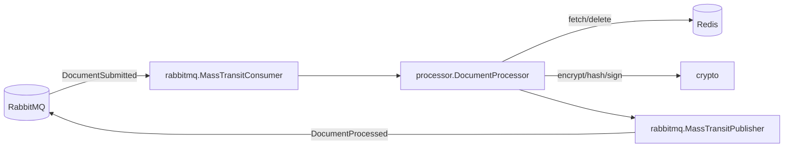
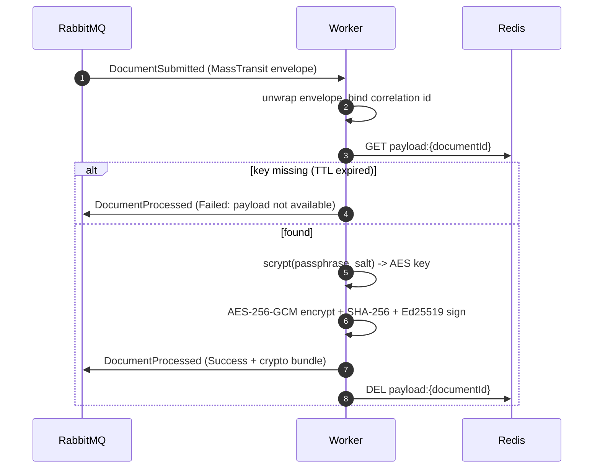

# securedocs-crypto-worker

SecureDocs is a distributed evidence vault: users submit documents and the system returns a cryptographic proof (hash + Ed25519 signature over the hash and processing timestamp) that anyone holding the public key can verify independently, without trusting the service. The pattern fits use cases like legal document timestamping, regulatory evidence archival, or proof-of-submission systems.

This repository is the worker: the process that performs the cryptographic operations for server-side submissions.

---

## Table of contents

- [What this service does](#what-this-service-does)
- [Tech stack](#tech-stack)
- [Running locally](#running-locally)
- [Configuration](#configuration)
- [Architecture](#architecture)
- [Project structure](#project-structure)
- [Processing flow](#processing-flow)
- [Design decisions](#design-decisions)
- [Testing](#testing)

---

## What this service does

- Consumes a `DocumentSubmitted` event from RabbitMQ when the API accepts a submission.
- Fetches the plain payload and the user-supplied passphrase from Redis.
- Derives an AES-256 key from the passphrase and a per-document random salt using scrypt.
- Encrypts the payload with AES-256-GCM, hashes the plaintext with SHA-256, and signs `hash || processedAt` with its Ed25519 private key.
- Publishes a `DocumentProcessed` event back to RabbitMQ carrying the ciphertext, nonce, tag, salt, KDF metadata, hash and signature.
- Deletes the Redis key after processing.
- Exposes a minimal `/health` HTTP endpoint for liveness checks.

The worker holds no database credentials and never connects to Postgres. The passphrase and the derived key live in memory only for the duration of processing and are then discarded.

---

## Tech stack

| Concern | Choice |
| --- | --- |
| Runtime | Python 3.12 |
| Execution model | Synchronous, one message at a time per instance |
| Broker client | `pika` |
| Redis client | `redis` (sync) |
| Cryptography | `cryptography` (PyCA) — AES-256-GCM, scrypt, SHA-256, Ed25519 |
| Configuration | `pydantic-settings` |
| Event contracts | `pydantic` |
| Logging | `structlog` (JSON, correlation id via contextvars) |
| Packaging | `uv` |
| Lint / format | `ruff` |
| Type checking | `mypy --strict` |
| Unit tests | `pytest` |
| Integration tests | `pytest` + `testcontainers` |

---

## Running locally

Requires Docker. For local (non-container) runs, Python 3.12 and `uv` (or `pip`).

### With Docker Compose

```bash
docker compose up --build
```

This starts Redis, RabbitMQ (with its management UI on `:15672`), and the worker. The worker's Ed25519 keypair is persisted to a mounted `./keys` volume so it survives restarts.

### Locally

```bash
python3.12 -m venv venv
venv/bin/pip install --editable . --group dev
cp .env.example .env   # then edit the connection URLs
venv/bin/python -m securedocs_worker
```

The worker connects to RabbitMQ and Redis, declares its queue, and blocks consuming. `SIGTERM`/`SIGINT` trigger a graceful shutdown.

---

## Configuration

Defaults live in `config.py`. Every value can be overridden through environment variables using the `__` separator (e.g. `RABBITMQ__PREFETCH_COUNT=5`). `REDIS__URL` and `RABBITMQ__URL` are required and have no defaults — the worker fails fast at startup if they are missing.

| Key | Required | Purpose |
| --- | --- | --- |
| `REDIS__URL` | yes | Redis connection URL |
| `RABBITMQ__URL` | yes | RabbitMQ AMQP URL |
| `REDIS__PAYLOAD_KEY_PREFIX` | no | Prefix for the Redis payload key (default `payload:`) |
| `RABBITMQ__SUBMITTED_QUEUE` | no | Queue the worker consumes from |
| `RABBITMQ__SUBMITTED_EXCHANGE` | no | Exchange the API publishes `DocumentSubmitted` to |
| `RABBITMQ__PROCESSED_EXCHANGE` | no | Exchange the worker publishes `DocumentProcessed` to |
| `RABBITMQ__PREFETCH_COUNT` | no | Unacked messages allowed in flight (default 1) |
| `KEYS__PRIVATE_KEY_PATH` | no | Ed25519 private key file (PEM) |
| `KEYS__PUBLIC_KEY_PATH` | no | Ed25519 public key file (PEM) |
| `CRYPTO__SCRYPT_N` / `_R` / `_P` | no | scrypt cost parameters (defaults 16384 / 8 / 1) |
| `HEALTHCHECK__PORT` | no | Port for the `/health` endpoint (default 8080) |

---

## Architecture

The worker does one thing — consume, process, publish — so it uses a flat module layout rather than a layered architecture. Each module has a single responsibility; dependencies are passed in explicitly, which keeps every unit testable in isolation.



`crypto.py` is pure functions with no I/O. Key persistence (`keystore.py`), message transport (`rabbitmq.py`) and the ephemeral store (`redis_store.py`) are separate concerns wired together in `__main__.py`.

---

## Project structure

```
src/securedocs_worker/
├── __main__.py        Entry point: config -> wiring -> consume, graceful shutdown.
├── config.py          pydantic-settings; required/optional split.
├── crypto.py          Pure functions: salt/nonce, scrypt, AES-256-GCM, SHA-256, Ed25519.
├── keystore.py        Load-or-generate the Ed25519 keypair (PEM).
├── events.py          Pydantic models matching the MassTransit wire format.
├── redis_store.py     Fetch and delete the {payload, passphrase} blob.
├── rabbitmq.py        MassTransit-compatible consumer and publisher.
├── processor.py       End-to-end orchestration; canonical signing timestamp.
├── health.py          Liveness HTTP endpoint on a daemon thread.
└── logging_setup.py   structlog JSON configuration.

tests/
├── unit/              No infrastructure; fast.
└── integration/       Real Redis + RabbitMQ via Testcontainers (requires Docker).
```

---

## Processing flow



---

## Design decisions

### Synchronous, scaled horizontally

The worker processes one message at a time per instance and scales by running more instances, not by concurrency within a process. Each message does a small amount of CPU work (KDF, encryption, signing) plus I/O. Synchronous code with `pika` is simpler to reason about and test than an async event loop, and horizontal scaling is the canonical pattern for this kind of stateless consumer. `prefetch_count` is 1 so RabbitMQ does not send a second message until the current one is acked.

### Passphrase-based key derivation

The worker never holds a symmetric key of its own. The user supplies a passphrase with the submission; the worker derives the AES-256 key with scrypt over the passphrase and a per-document random salt. The salt and KDF parameters are published back so the user can reproduce the key later; the passphrase and derived key are discarded after processing. scrypt is memory-hard, which makes offline brute-forcing of a stolen ciphertext expensive regardless of the attacker's tooling.

### Pure crypto separated from key lifecycle

`crypto.py` contains only pure functions — same input, same output, no I/O. Generating or loading the Ed25519 keypair from disk is a separate concern in `keystore.py`. This keeps the cryptographic core trivial to test and isolates filesystem and lifecycle logic in one place.

### Ed25519 signing key: load-or-generate

On startup the worker loads the Ed25519 private key from disk, or generates and persists one (PEM, private key `chmod 0600`). The signing key must be stable: if it changes, every previously issued signature becomes unverifiable. The lazy generate-on-first-run pattern works for a single instance or a controlled first run. Running multiple fresh instances against an empty key volume would race and produce divergent keypairs; the key should be provisioned once, out of band, before scaling out.

### MassTransit envelope compatibility

The API publishes through MassTransit, which wraps messages in an envelope (`messageType`, `message`, `headers`, …). The worker unwraps inbound envelopes and constructs equivalent outbound ones so the API's consumer can route the result. The exact envelope and exchange-name conventions are reproduced from observed behaviour. The integration test verifies the worker's own round-trip; definitive cross-service compatibility is confirmed by the end-to-end smoke test in the deployment setup.

### Canonical signing timestamp

The signed message is `hash || processedAt` where `processedAt` is a canonical UTC ISO 8601 string with millisecond precision and a `Z` suffix. `processedAt` is truncated to milliseconds before use so the value that is signed and the value that is persisted are identical, and any verifier can reconstruct the exact signed bytes.

### Thread-safe consumer shutdown

`pika`'s `BlockingConnection` is not thread-safe. Stopping the consumer from a signal handler or another thread schedules the shutdown on the connection's I/O loop via `add_callback_threadsafe` rather than calling channel methods across threads.

### Liveness, not readiness

`/health` returns 200 from a daemon thread: it signals that the process is responsive, which is the meaningful check for a consumer with no inbound HTTP traffic. A fully wedged process (e.g. a GIL deadlock in a C call) stops answering, so the check still catches that. A readiness check that verifies broker connectivity is a possible enhancement.

### Failure handling

A submission whose Redis key is gone (TTL expired) produces a `Failed` event with reason `payload not available`. An unexpected error during cryptographic processing produces a `Failed` event with reason `processing error`. Both let the API transition the document to a terminal state so the client always learns the outcome.

### Known gap: redelivery idempotency

If RabbitMQ redelivers a `DocumentSubmitted` after the worker already processed it (e.g. a lost ack), the Redis key is gone and the worker emits a spurious `Failed`. Worker-side deduplication is not yet implemented and is tracked as a follow-up.

---

## Testing

Unit tests cover the crypto functions, event models, config, the Redis adapter, the MassTransit envelope handling, the processor orchestration, the keystore and the health endpoint. They require no infrastructure.

```bash
venv/bin/pytest tests/unit
```

The integration test runs the full pipeline against real Redis and RabbitMQ containers managed by Testcontainers: it seeds Redis, publishes a MassTransit `DocumentSubmitted`, runs the consumer, and asserts the published `DocumentProcessed` has a verifiable signature and decryptable ciphertext.

```bash
venv/bin/pytest tests/integration
```

Integration tests require Docker.
